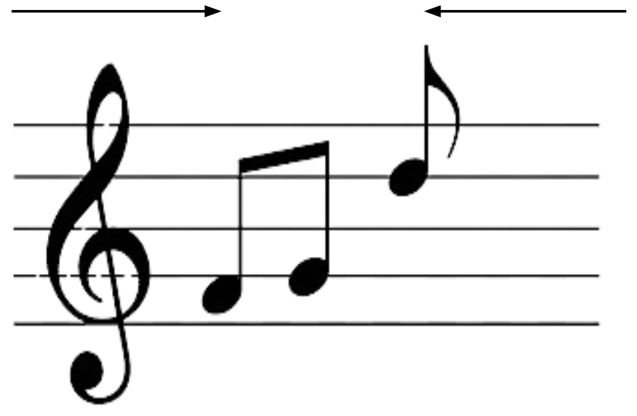
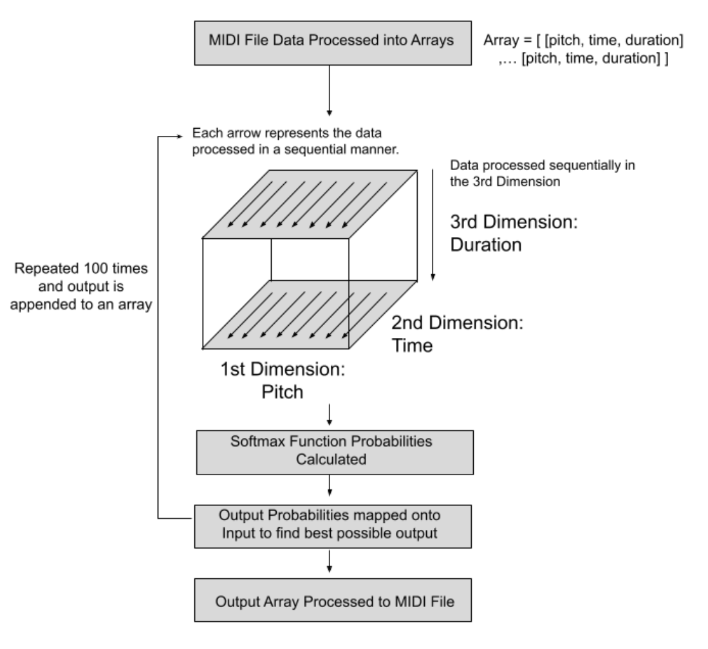
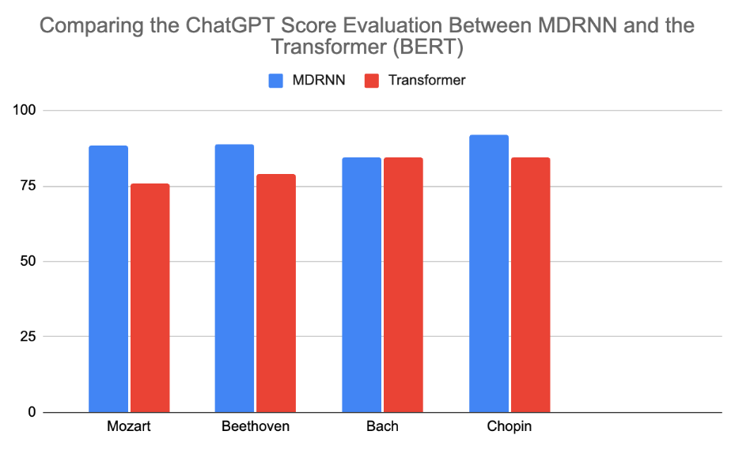
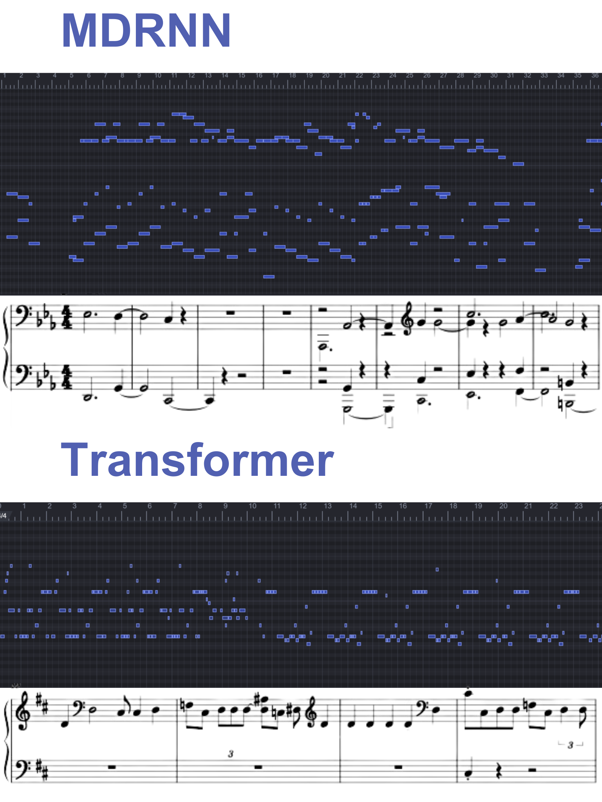

# Advancing Polyphonic Music Generation with Multi-Dimensional Recurrent Neural Networks

## Description
Artificial Intelligence models in polyphonic music generation introduce capabilities to produce compositions with coherent and pleasing progressions yet face major limitations like capturing the diversity of polyphonic music sequences, generating chords beyond training data, and maintaining originality as the complexity of music increases. This project explores the application of Multi-Dimensional Recurrent Neural Networks (MDRNNs) to tackle these challenges by leveraging their unique ability to process multidimensional data. As for our procedures: MIDI data was preprocessed into arrays. The MDRNN model takes in these inputs and calculates probabilities for musical elements-pitch, time, and duration. With these probabilities, the model was able to generate additional music elements. This process was repeated to generate a new MIDI file. We evaluated music from MDRNN and Transformer models using ChatGPT's score metric on musical expression, coherence, tempo, and timing. We uploaded the generated music from both models into ChatGPT and found that the MDRNN outperformed Transformer by an average of 9.43% across compositions by Mozart, Beethoven, Bach, and Chopin.

## Methodology

### Data Preprocessing

The preprocessing of MIDI files is an important step in preparing data for effective model training and music generation. Here’s how we process each file:

- **Data Conversion:** MIDI files are initially converted into Numpy arrays. Each array captures musical elements necessary for generation: pitch, time, and duration.

- **Data Representation:** We organize the data within each array into structured triples that represent each musical note: 

```bash
[ [Pitch1, Time1, Duration1], [Pitch2, Time2, Duration2], ..., [Pitchn, Timen, Durationn] ]
```

Pitch is treated as a discrete attribute and encoded as a one-hot vector, while time and duration are continuous attributes and are represented numerically.

- **Data Normalization:** To standardize input data, all files are padded to ensure they contain exactly 4992 notes, maintaining uniformity across the dataset.

- **Feature Engineering:** The reshaped data consists of three columns corresponding to each musical attribute (pitch, time, duration), structured into sequences of 8-time steps with 624 feature dimensions (208 dimensions per attribute).

- **Batch Processing:** The model is trained on a batch size of one, allowing for precise adjustments and optimization on a per-file basis, ideal for our dataset of 1000 files.

### Multi-Dimensional Recurrent Neural Network (MDRNN)

Our MDRNN is made to address the limitations of polyphonic music generation by processing multiple dimensions of music data:

- **Dimensional Segregation:** We separate pitch, time, and duration into distinct dimensions, enabling the model to process each attribute independently. This approach enhances the accuracy and expressiveness of the generated music.

- **Bi-directional LSTM Units:** To effectively capture the dependencies in musical sequences, each dimension is processed using a bidirectional LSTM unit. This architecture choice also mitigates the vanishing gradient problem and ensures that both preceding and following notes influence the generation process.

- **Architecture Details:** The network incorporates three hidden layers for each LSTM dimension, matching the input data's dimensions. This structure stabilizes learning and supports detailed feature capture.



*Figure 1: A representation of the bi-directional LSTM moving in both directions to read input*

### Prediction and Training Process

The model's primary task is to predict a series of pitch, time, and duration values to generate additional sheet music:

- **Loss Calculation:** During training, our model computes the loss between the sequential inputs (from 1 to n-1 of the dataset) and the gold values (from 2 to n), aiming at accurate learning of music sequences.

- **Output Processing:** The MDRNN's output layer, a linear layer sized at 2 times the hidden dimension due to the bidirectional nature of the LSTMs, performs a softmax function. This function converts the layer outputs into a series of probability distributions over possible output values.

- **Prediction Mapping:** The highest probabilities from the output layer are mapped onto their respective class labels for pitch, time, and duration. These predicted values are the ones with the highest probability of following the last known value in each sequence.

- **Sequential Predictions:** This prediction process is repeated sequentially 100 times to generate a series of 100 predictions, each building upon the last, to form a coherent piece of music extending from the input data.

### Methodology Diagram

Below is a diagram illustrating our methodology:



*Figure 2: A diagram outlining the process from data preprocessing to music generation of the MDRNN model.*

## Results and Evaluation

### Evaluation with ChatGPT

Traditional metrics like loss functions are typically used to evaluate how closely a model's output mimics the validation dataset, which is not always indicative of the quality or originality of generated music. To address this, we utilized ChatGPT as a more relevant evaluator for music generation. ChatGPT offers a relatively "objective" metric that reflects aspects more closely related to standards of music theory. 

#### Evaluation Setup:
We conducted a comparison between our Multi-Dimensional Recurrent Neural Network (MDRNN) and a standard BERT Transformer model. We took 10 famous pieces from each composer, Mozart, Beethoven, Bach, and Chopin, to generate new music. These pieces were processed by both models to produce 10 MIDI files each, which were then converted into sheet music using MuseScore for evaluation.

#### Scoring:
ChatGPT evaluated the music based on a detailed rubric that included:
- Musical expression
- Coherence
- Tempo and timing

Each generated piece was scored out of a possible 100 points. 

#### Results:
The comparative analysis revealed that the MDRNN consistently outperformed the BERT Transformer. On average, the MDRNN scored 9.44% higher across all compositions, demonstrating its potential to generate music that surpasses the current models. 



*Figure 3:  MDRNN vs. Transformer performance on ChatGPT Evaluation over four different classical music composers.*

### Visual Comparison of Generated Music Outputs

The image below provides a direct visual comparison of music generated by the two models:




*Figure 4: Comparative analysis between outputs generated from "L'orage (The Storm)" between the MDRNN Model (top) and Transformer (bottom)'s generation.*

Following this comparative analysis, it's evident that the MDRNN model produces a more complex polyphonic structure, which includes a wide range of pitch, time, and duration elements. This indicates the MDRNN's capability to generate compositions that expand beyond the constraints of the training data. In contrast, the Transformer model displays a tendency towards simpler, monophonic patterns with repetitive elements, especially towards the end of the generation. 

## Current Limitations

While our MDRNN model has demonstrated promising results, it is important to acknowledge its current limitations:

- **Inconsistency in Quality**: The quality of music generated by the model varies. Some outputs may reflect well with the training data's complexity, while others may not capture the intended musicality as effectively.
  
- **Playability**: The generated compositions may include intervals that span beyond an octave, making them impossible for human performers to play. Sometimes, the model produces chords that consist of more than two simultaneous notes, which is not practical for a single pianist due to the physical limitations of having only two hands.

- **Music Theory**: Currently, the model lacks an understanding of musical scales and theoretical frameworks, which occasionally leads to compositions that do not adhere to conventional harmony and structure.

Addressing these limitations will be a focus of our ongoing research and development.

## Conclusion and Future Directions

The journey of advancing polyphonic music generation with AI is ongoing. Our MDRNN model is just one step towards a future where AI can support the creative process of music composition. Recognizing the current limitations, we plan to integrate more elements of music theory to enhance the playability and human performance aspects of the generated music. Looking ahead, the adaptability of MDRNNs to different musical genres and contexts opens up the possibility of our model to accommodate numerous of musical instruments. The ultimate goal of our research is not to replace composers but to provide them with tools for creating accompaniments—something that can be time-consuming and, at times, secondary to their primary focus. Composers often seek to create rich, engaging primary melodies and may find the task of composing accompaniments less rewarding. Moreover, for performers, especially in classical and vocal music, the absence of accompaniment will cause an incomplete musical experience. By working to make AI understand and apply music theory for the automatic generation of accompaniments, we can offer a tool that fills the gap in solo performances. We believe that AI can become a major part of the music composition process, offering composers and performers a collaborative partner that enhances the human musical experience.

## License and Patent Notice
This project is protected under a provisional patent application, and all rights are reserved. Without prior consent from the patent holders, the use, reproduction, modification, distribution, or replication of any part of this software and its associated methodologies is strictly prohibited. This restriction is in place to maintain the integrity of the project and protect the intellectual property while the patent process is ongoing.

No open-source license is applied to this project. Once the full patent is granted, unauthorized use of the technology described and implemented in this software will be challenged legally. For licensing inquiries or permissions, please contact tonyhuang23x@gmail.com

## Installation

### Prerequisites
Before installing, make sure you have Python and Pip installed on your system. This project requires the following Python libraries, which can be installed using Pip:

- `torch`: Used for building and training the neural network models.
- `numpy`: Provides support for efficient numerical computation.
- `sklearn`: Used for preprocessing data and other machine learning utilities.
- `pretty_midi`: Allows handling and manipulating MIDI data.

You can install these packages using the following command:

```bash
pip install torch numpy scikit-learn pretty_midi
```

### Setup
Download the project files:
- Manually download the ZIP file of the project and extract it to your desired location.
Install the required libraries:

```bash
pip install torch numpy scikit-learn pretty_midi
```

### Usage
To generate music using the pre-trained MDRNN model, simply run the following command:

```bash
python music_generate2.py
```

This script manages the entire process, including preprocessing the MIDI data, running the model to generate new music data, and postprocessing the output to convert it back to MIDI format. The resulting MIDI files will be saved as an "output.mid" file. 

## Contact
For any questions, licensing requests, or further information, you can reach out at tonyhuang23x@gmail.com

## Acknowledgments
- Thanks to the contributors of the ADL Piano MIDI Dataset for providing the data necessary for training our models. The dataset was introduced by Lucas N. Ferreira, Levi H.S. Lelis, and Jim Whitehead in their paper "Computer-Generated Music for Tabletop Role-Playing Games," presented at the 16th AAAI Conference on Artificial Intelligence and Interactive Digital Entertainment (AIIDE'20) in 2020. 

## References

- Bittner, R. M., Bosch, J. J., Rubinstein, D., Meseguer-Brocal, G., & Ewert, S. (2022). A lightweight instrument-agnostic model for polyphonic note transcription and multipitch estimation. In ICASSP 2022-2022 IEEE International Conference on Acoustics, Speech and Signal Processing (ICASSP) (pp. 781-785). IEEE.

- Edirisooriya, S., Dong, H. W., McAuley, J., & Berg-Kirkpatrick, T. (2021). An empirical evaluation of end-to-end polyphonic optical music recognition. arXiv preprint arXiv:2108.01769.

- Ferreira, L., Lelis, L., & Whitehead, J. (2020). Computer-generated music for tabletop role-playing games. In Proceedings of the AAAI Conference on Artificial Intelligence and Interactive Digital Entertainment (Vol. 16, No. 1, pp. 59-65).

- Graves, A., Fernández, S., & Schmidhuber, J. (2007). Multi-dimensional recurrent neural networks. In International conference on artificial neural networks (pp. 549-558). Springer Berlin Heidelberg.

- Huang, C.-Z. A., Vaswani, A., Uszkoreit, J., Shazeer, N., Simon, I., Hawthorne, C., Dai, A. M., Hoffman, M. D., Dinculescu, M., & Eck, D. (2018). Music transformer. Retrieved from https://arxiv.org/abs/1809.04281

- Kobs, K., Steininger, M., Zehe, A., Lautenschlager, F., & Hotho, A. (2020). Simloss: Class similarities in cross entropy. In Foundations of Intelligent Systems: 25th International Symposium, ISMIS 2020, Graz, Austria, September 23–25, 2020, Proceedings (pp. 431-439). Springer International Publishing.

- Kumar, H., & Ravindran, B. (2019). Polyphonic music composition with LSTM neural networks and reinforcement learning. arXiv preprint arXiv:1902.01973.

- Li, Y., Liu, H., Jin, Q., Cai, M., & Li, P. (2023). TrOMR: Transformer-Based Polyphonic Optical Music Recognition. In ICASSP 2023-2023 IEEE International Conference on Acoustics, Speech and Signal Processing (ICASSP) (pp. 1-5). IEEE.

- Open Music Theory. (n.d.). Retrieved from https://openmusictheory.github.io/

- Raj, A. (2023). Understanding retinamask. Retrieved from https://medium.com/mlearning-ai/understanding-retinamask-e6f6feb814e5.

- Magenta. (n.d.). Retrieved from https://magenta.tensorflow.org/research/

- Shatri, E., & Fazekas, G. (2020). Optical music recognition: State of the art and major challenges. arXiv preprint arXiv:2006.07885.
